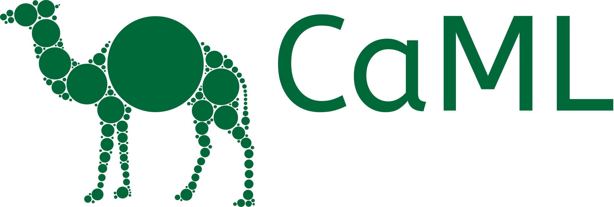

<h1>

</h1>

## Welcome!

CaML = **Ca**usal **M**achine **L**earning

Extensions & abstractions on top of [EconML](https://github.com/py-why/EconML) with techniques motivated primarily by [Causal ML Book](https://causalml-book.org/) and additional research.
